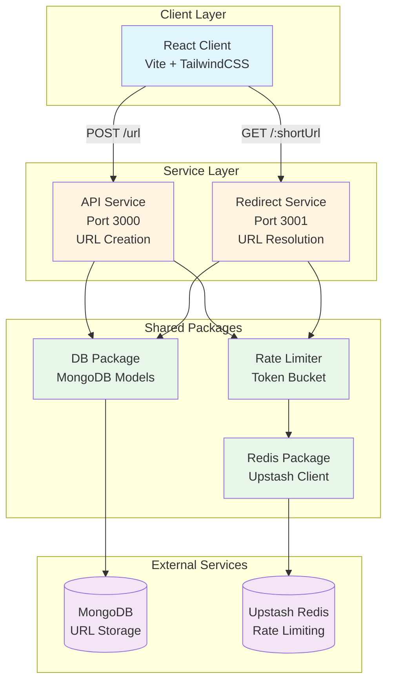
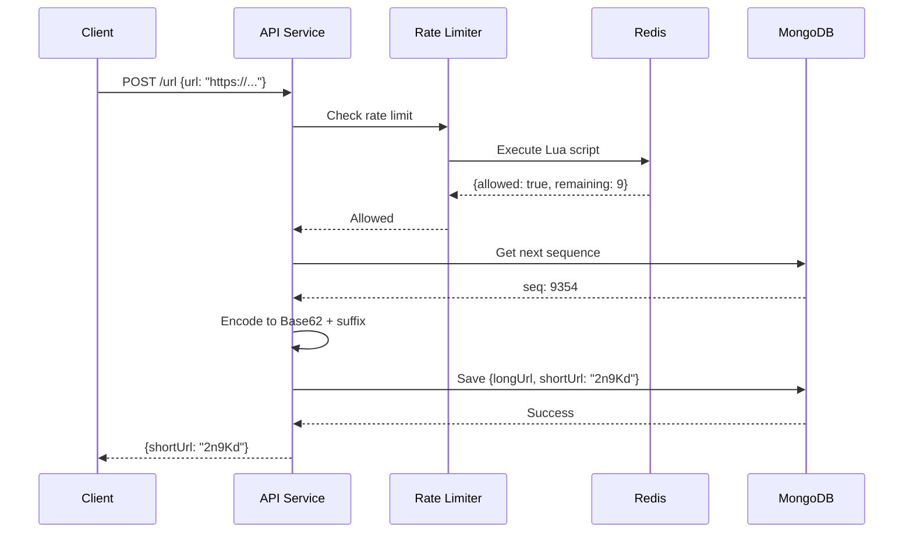
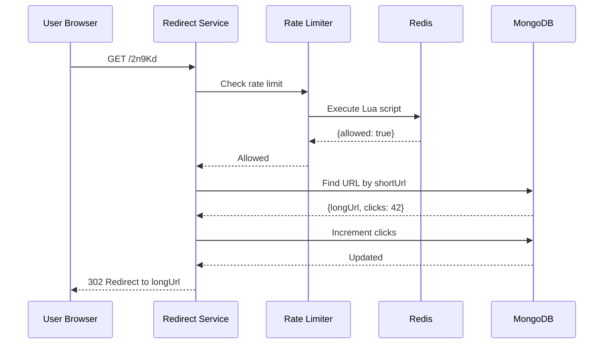
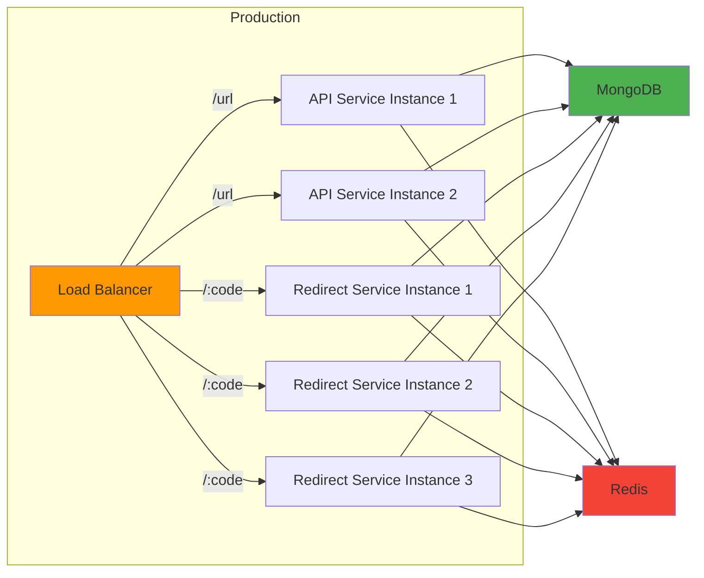

# URL Shortener - System Architecture

## Overview

This is a **scalable URL shortener** built with a microservices architecture in a monorepo structure. The system is designed for high performance, abuse prevention, and clean separation of concerns.

## Architecture Diagram



## System Components

### 1. Client Application (`apps/client`)

**Technology Stack:**
- React 19 with TypeScript
- Vite for build tooling
- TailwindCSS for styling
- Axios for HTTP requests
- React Hot Toast for notifications

**Responsibilities:**
- User interface for URL shortening
- Input validation
- Display shortened URLs
- Copy to clipboard functionality
- Error handling and user feedback

**Key Features:**
- Responsive design
- Real-time validation
- Toast notifications for all user actions
- Loading states with animations

---

### 2. API Service (`apps/api-service`)

**Port:** 3000
**Technology:** Express.js + TypeScript (ES Modules)

**Endpoints:**
- `GET /` - Health check
- `POST /url` - Create shortened URL

**Request Flow:**
```
1. Receive URL from client
2. Rate limit check (10 req/min per IP)
3. Generate unique sequence ID
4. Encode ID to Base62 with random suffix
5. Store in MongoDB
6. Return short URL code
```

**Key Features:**
- CORS enabled for client communication
- Rate limiting via Redis token bucket
- Atomic sequence generation
- Base62 encoding with random suffix for security
- MongoDB connection with error handling

**Dependencies:**
- `@url-shortener/db` - Database models
- `@url-shortener/redis` - Redis client
- `@url-shortener/rate-limiter` - Rate limiting logic
- `express` - Web framework
- `cors` - CORS middleware
- `zod` - Environment validation

---

### 3. Redirect Service (`apps/redirect-service`)

**Port:** 3001
**Technology:** Express.js + TypeScript (ES Modules)

**Endpoints:**
- `GET /:shortUrl` - Redirect to original URL

**Request Flow:**
```
1. Receive short URL code
2. Rate limit check (10 req/min per IP)
3. Query MongoDB for original URL
4. Increment click counter
5. HTTP 301/302 redirect to original URL
```

**Key Features:**
- Fast URL lookup
- Click tracking
- Rate limiting protection
- 404 handling for invalid codes

**Dependencies:**
- `@url-shortener/db` - Database models
- `@url-shortener/redis` - Redis client
- `@url-shortener/rate-limiter` - Rate limiting logic
- `express` - Web framework

---

## Shared Packages

### 1. Database Package (`packages/db`)

**Purpose:** Centralized MongoDB models and connection logic

**Models:**
- **Url Model:**
  ```typescript
  {
    longUrl: string,      // Original URL
    shortUrl: string,     // Shortened code (unique)
    clicks: number,       // Click counter
    createdAt: Date       // Timestamp
  }
  ```

- **Counter Model:**
  ```typescript
  {
    name: string,         // Counter identifier
    seq: number          // Current sequence (starts at 9353)
  }
  ```

**Exports:**
- `connectToDB(url)` - MongoDB connection function
- `Url` - Mongoose model for URLs
- `Counter` - Mongoose model for sequences

---

### 2. Redis Package (`packages/redis`)

**Purpose:** Upstash Redis client initialization

**Features:**
- Singleton pattern for Redis connection
- Environment-based configuration
- Lazy initialization
- Error handling for missing credentials

**Exports:**
- `getRedis()` - Returns Redis client instance
- `initRedis(config)` - Initialize with custom config

---

### 3. Rate Limiter Package (`packages/rate-limiter`)

**Algorithm:** Token Bucket (implemented in Lua for atomicity)

**How It Works:**
```
1. Each IP gets a bucket with N tokens
2. Tokens refill at R tokens/second
3. Each request consumes 1 token
4. If tokens < 1, request is rejected (429)
5. Lua script ensures atomic operations
```

**Configuration:**
- Capacity: 10 tokens
- Refill Rate: 10 tokens per 60 seconds (1 token per 6 seconds)
- TTL: Auto-expire inactive buckets

**Benefits:**
- Prevents abuse
- Fair resource allocation
- Atomic operations via Lua
- Distributed rate limiting (Redis-backed)

---

## Data Flow

### URL Creation Flow



### URL Redirect Flow



---

## Technology Choices

### Why Microservices?

1. **Separation of Concerns:** URL creation and redirection are independent
2. **Scalability:** Can scale redirect service independently (higher traffic)
3. **Fault Isolation:** API failure doesn't affect redirects
4. **Independent Deployment:** Deploy services separately

### Why MongoDB?

1. **Schema Flexibility:** Easy to add fields (analytics, expiration)
2. **Horizontal Scalability:** Sharding support for growth
3. **Atomic Operations:** `findOneAndUpdate` for counters
4. **Fast Lookups:** Indexed queries on `shortUrl`

### Why Redis (Upstash)?

1. **Serverless:** No infrastructure management
2. **Low Latency:** Fast rate limit checks
3. **Atomic Operations:** Lua scripts for consistency
4. **Auto-Expiry:** TTL for inactive buckets

### Why Base62 Encoding?

1. **URL-Safe:** Only alphanumeric characters
2. **Compact:** Shorter than Base10
3. **Readable:** No special characters
4. **Scalable:** 62^7 ≈ 3.5 trillion combinations

---

## Security Features

### 1. Rate Limiting
- **Global:** 10 requests per minute per IP
- **Algorithm:** Token bucket (fair and predictable)
- **Storage:** Redis (distributed)

### 2. Input Validation
- URL format validation (client + server)
- Zod schema validation for environment variables
- TypeScript for type safety

### 3. Random Suffix
- Prevents enumeration attacks
- Makes short URLs unpredictable
- 2-character suffix = 3,844 combinations per ID

---

## Scalability Considerations

### Current Capacity
- **Short URLs:** 62^7 ≈ 3.5 trillion unique codes
- **Rate Limit:** 10 req/min per IP (adjustable)
- **Database:** MongoDB supports horizontal scaling

### Future Enhancements
1. **Caching Layer:** Redis cache for hot URLs
2. **CDN Integration:** Serve redirects from edge locations
3. **Analytics:** Track clicks, referrers, geolocation
4. **Custom Aliases:** User-defined short codes
5. **Expiration:** TTL for temporary URLs
6. **API Keys:** Authentication for API access

---

## Monorepo Structure

```
url-shortener/
├── apps/
│   ├── client/          # React frontend
│   ├── api-service/     # URL creation service
│   └── redirect-service/# URL redirect service
├── packages/
│   ├── db/             # MongoDB models
│   ├── redis/          # Redis client
│   └── rate-limiter/   # Rate limiting logic
└── docs/
    └── ARCHITECTURE.md  # This file
```

**Benefits:**
- **Code Sharing:** Shared packages across services
- **Consistent Tooling:** Single pnpm workspace
- **Atomic Changes:** Update multiple packages together
- **Type Safety:** Shared TypeScript types

---

## Environment Variables

### API Service & Redirect Service
```env
UPSTASH_REDIS_REST_URL=https://...
UPSTASH_REDIS_REST_TOKEN=...
MONGO_URI=mongodb+srv://...
```

### Client
```env
VITE_API_SERVICE_URL=http://localhost:3000
VITE_REDIRECT_SERVICE_URL=http://localhost:3001
```

---

## Performance Metrics

### Expected Performance
- **URL Creation:** < 100ms (including DB write)
- **URL Redirect:** < 50ms (DB lookup + redirect)
- **Rate Limit Check:** < 10ms (Redis Lua script)

### Bottlenecks
1. **MongoDB Writes:** Mitigated by indexing
2. **Redis Latency:** Using Upstash (global edge network)
3. **Network:** CORS adds minimal overhead

---

## Deployment Architecture



**Scaling Strategy:**
- More redirect instances (higher read traffic)
- Fewer API instances (lower write traffic)
- MongoDB replica set for read scaling
- Redis cluster for distributed rate limiting

---

## Conclusion

This architecture provides a **solid foundation** for a production-ready URL shortener with:
- ✅ High performance
- ✅ Abuse prevention
- ✅ Scalability
- ✅ Clean code organization
- ✅ Type safety
- ✅ Monitoring-ready structure

The microservices approach allows independent scaling and deployment while the monorepo structure keeps code organized and maintainable.